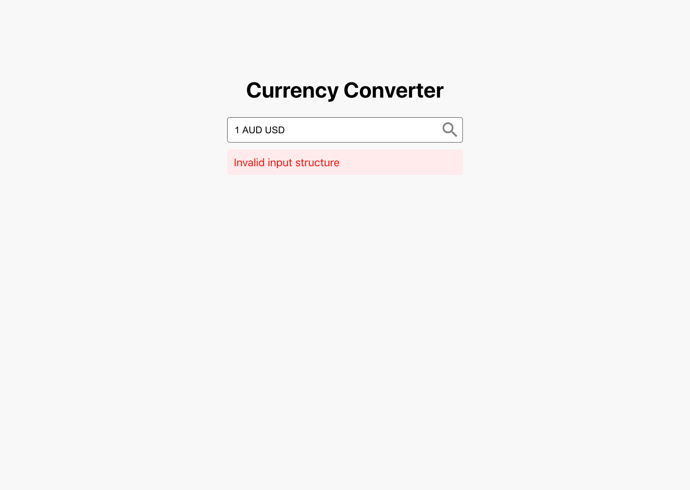
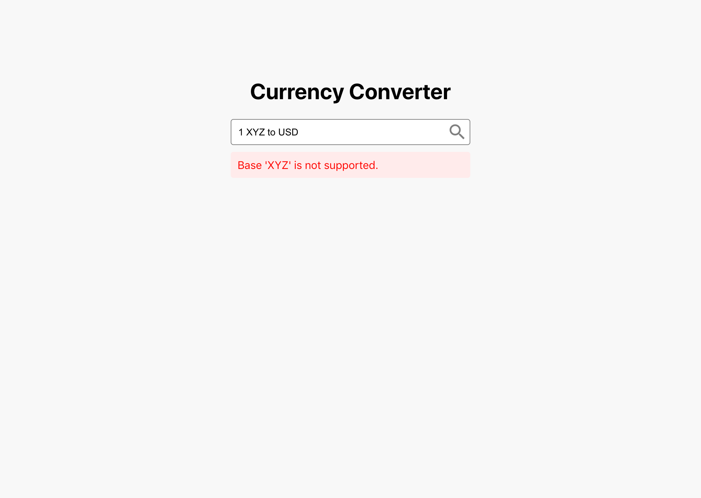

# ps-currency-converter-ts

## 🔢 Getting Started

1. Clone the repo and run `npm install`
2. Start the app via `npm start`
3. Sign up for a free API key at https://exchangeratesapi.io and set it to the `API_KEY` variable

_⚠️ Be careful not to expose your API key in publicly visible git repositories._

_⚠️ If you run out of API requests during development you can create another account using a different email._

## ⌨️ Available Scripts

In the project directory, you can run:

### `npm start`

Runs the app in the development mode.
Open [http://localhost:3000](http://localhost:3000) to view it in the browser.

The page will reload if you make edits.

### `npm test`

Launches the test runner in the interactive watch mode.
See the section about [running tests](https://facebook.github.io/create-react-app/docs/running-tests) for more information.

## 📋 Challenge Instructions

You have been tasked with building a simple currency converter app as per the below Requested Features and Screenshots sections.

The user can enter a query into the input, e.g. 1 EUR to USD, and the app will display the converted amount.

You are also welcome to propose and add new features that you believe will enhance the functionality or user experience.

It may be challenging to complete all the features within the allocated timeframe. We are more interested in the implementation quality of the features you _can_ complete rather than seeing them _all_ complete.

### 🌟 Requested Features

1. Display the converted amount based on the exchange rate from the API.
2. Display errors related to user input or from the exchange rate API.
3. Support case insensitive user input.
4. Allow the displayed converted amount to be swapped, e.g EUR-to-USD can be swapped to USD-to-EUR via the up-down arrows button.
5. Display a history of previous converted amounts with no fixed limit on the number of items.
6. Delete previous converted amounts.
7. Add pagination for long lists of previous converted amounts.

### 🔧 Implementation Notes

- The foundations of the app and a recommended exchange rate API integration are provided for you.
- You can reuse what is already there or start from scratch.
- You are also free to use third party packages as needed.
- The UI need not be pixel perfect. Near enough is good enough.

## 📥 How to submit the challenge

1. Fork or clone this repo into your publicly accessible git profile.
2. Raise a Pull Request (PR) with your solution.
   - We encourage you to use git appropriately.
   - For example, we would prefer to see a sensible git commit history instead of one large commit with all of the code changes.

_⚠️ Please ensure the PR is raised on your repository and not this repository._

## 🖼 Screenshots

_⚠️ The screenshots use AUD as a base currency but this is only for illustration purposes. The recommended exchange rates API limits the base currency to EUR only._

### 🌟 Deliverables

All the requested features are delivered. Please follow the same instractions in order to run the app with the only addition of the creation of the .env file at the root of the repository with two values as shown below:

REACT_APP_EXCHANGE_RATES_BASE_URL="http://api.exchangeratesapi.io/v1"
REACT_APP_EXCHANGE_RATES_API_KEY="exampleMockKey"

for the "exampleMockKey" please use your own key. Keep in mind that the free version of the keys are very restricted into request and for using a specific endpoints.

Some unit tests are also created by Jest library and react testing library.

### 🌟 Future Improvements

Due to limited time a restricted features could be demonstrate in the specific exercise.

Making the Alert common reusable.
The first upgrade implementation that I would have done if I had some more time it would be to make the Alert of the Success or Failed communication with BE () reusable because as it is now it indeed satisfy our needs for this solution but with the first upgrade or integration with another endpoint it use it would be a necessity and would save a lot of time.

Authentication / Authorization.
Since there was not any specific business need behind the exercise I do not know if
an authentication authorization tool / implementation could make a difference. By this we could achieve to store the exchange rate history for each user. As it is now the history is stored only during run time.

Routing.
Since the requirements was specific for a single page app there was not a need for routing. but the history info could take place into a different url.

Global State.
A useContext hook or react redux could be used to store information like history so any child component could have access to it directly without passing through all the hierarchy of components as properties. Since the hierarchy was small there was no need to do so.

Responsive.
A mobile friendly design could take place in order for the app to be useful and with with user experience also on mobile devices.

Currency Converter Restrictions.
Restricted into just exchanging EUR to specific currencies and the wise versa was not accepted from the third party provider. According to their documentation there were a variate of endpoints that could be used and upgrade the possibilities of the app.

Tailwind Css or SASS.
Tailwind css or SASS/SCSS could be used to satisfy the face needs of the app, with the addition that these frameworks provides you grouping and reusing styles without the need of applying specific for every element. Colors could be a global variable and storing the hex codes at a single palette file. This approach will also help in the future if a Dark mode implementation needs to be done.

Wordings.
Wordings should be kept into a single file so that by the need of translating them could be much more easy especially with the use of modern libraries.

_⚠️ The screenshot show the appearance of the final output of the exercise and how it should look like after you run the app and configure the .env file._

